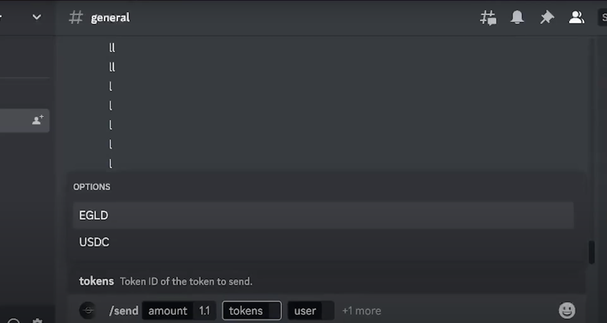

# Pulsar Money V2

## Executive Summary

### Project Introduction
Pulsar Money Version 2 (V2) builds upon the success of V1, introducing a Smart Payments Hub that simplifies cryptocurrency transactions. V2 enhances the hub with new features like invoicing, payment links, Discord integration, and Pulsar Pages.

### Market Opportunity & Value Proposition
Pulsar Money V2 excels within the MultiverseX Ecosystem, addressing real-world use cases. It offers:
- Invoices: Streamlined blockchain invoices for startups and businesses.
- Payment Links: Simplified payment requests with dedicated smart contracts.
- Discord Integration: Extending social payments to Discord.
- Pulsar Pages: A monetization platform for content creators.

## Meet the Team
- Lery: Software Engineer and Lead Developer
- Stefi: Design and Marketing Lead
- Calin: Software Engineer

## Business Description

### Problem Analysis & USP
Pulsar Money V2 aims to expand its user base by catering to both B2C and B2B markets. Its unique edge lies in offering comprehensive modules for businesses and individuals.

### Targeted Audience
- Primary Audience: Current Pulsar Money users.
- Potential Users: Established Businesses, Discord Community, Content Creators.

## Marketing Strategy
Pulsar Money V2 leverages its diverse modules for brand awareness. Discord integration and Pulsar Pages empower creators to promote the platform, driving user engagement and exploring the ecosystem.

## Revenue Strategy

### Pulsar Pages
- Initial Onboarding: Waived fees in early months.
- Long-Term Monetization: Fees for creators and users.

### Invoices
- Flexible Payment Options: Monthly subscription or pay-as-you-go.
- Stable Income: Consistent revenue for businesses.

### Discord Integration
- Revenue Inheritance: Aligning with Social Pay revenue strategy.

## Financial Plan & Risk Management

### Financial Breakdown
Pulsar V2 builds upon the existing infrastructure to minimize development costs.

### Risk & Mitigations
1. Adoption Delays: Targeted marketing and leveraging V1's success.
2. User Feedback Challenges: Phased rollout and early feedback prioritization.
3. Changing Market Trends: Flexible strategies and market monitoring.

## Conclusions - Final Words
Pulsar Money V2 continues the legacy of innovation in programmable payments. It aims to refine the MultiverseX Ecosystem, offering user-centric solutions and bridging technology with real-world applications. The dedicated team ensures Pulsar Money remains cutting-edge and relevant. The commitment is to revolutionize digital payments and unleash the blockchain's transformative potential.

For more details, refer to the full business plan.

## Demo Snapshots

### Payment Links
Initial Payment Links form:

Filled Payment Links form:

Creation of Payment Link:

### Invoices
Invoices landing page:

Filled invoice:

### Discord Payments Bot
Command overview of discord bot:

Fields of an empty send command:

Token field in the send command:

Receiver field in the send command:

Filled camping command:

### Pulsar Page
Landing Pulsar page:

Become a Pulsar page:
